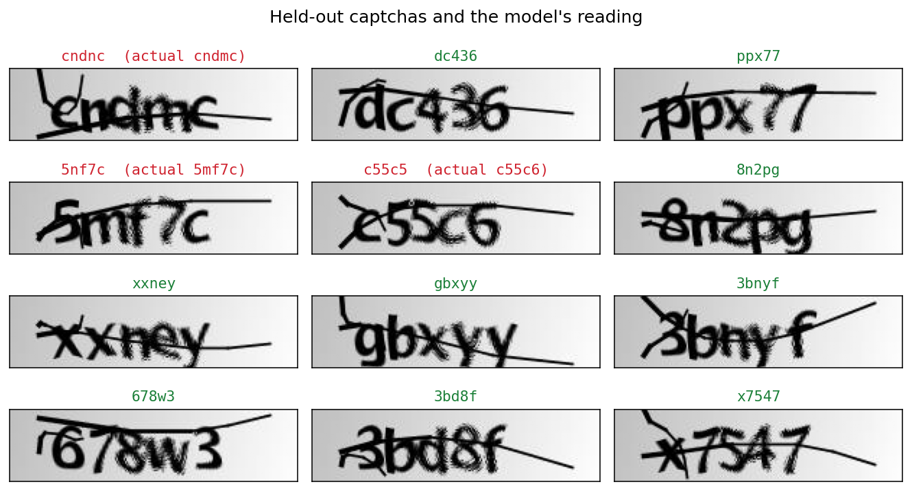

# Captcha Recognizer

A convolutional neural network that reads five-character captcha images. A single
convolutional trunk encodes the whole 200x50 image and five independent softmax
heads each predict one character position, so the network learns where characters
sit rather than being told.



## Requirements

Python 3.10 or later.

## Installation

```bash
pip install -r requirements.txt
```

For the test suite as well:

```bash
pip install -r requirements-dev.txt
```

## Usage

Train, evaluate on the held-out split, and write all figures and results:

```bash
python -m captcha_recognizer.cli train
```

Training takes about a minute on a laptop CPU.

Score an already-trained model:

```bash
python -m captcha_recognizer.cli evaluate
```

Read specific images:

```bash
python -m captcha_recognizer.cli predict samples/226md.png samples/22d5n.png
```

All three accept `--samples`, `--model`, `--docs`, `--results` and `--seed`;
`train` also takes `--epochs` and `--batch-size`.

## Results

1,070 labelled captchas split 856 train / 214 held out, 30 epochs, seed 0.

| position | accuracy |
| --- | --- |
| character 1 | 96.3% |
| character 2 | 93.5% |
| character 3 | 91.1% |
| character 4 | 88.3% |
| character 5 | 97.7% |
| mean per character | 93.4% |

Written to `results/` on every run:

| file | contents |
| --- | --- |
| `results/metrics.json` | per-character, mean and whole-captcha accuracy |
| `results/predictions.csv` | every held-out prediction beside its ground truth |

Figures land in `docs/`: `demo.png` is the prediction grid above, and
`training_curve.png` plots training against validation loss.

## How it works

**Preprocessing.** The generator draws a stroke through each captcha. `denoise()`
blurs to soften that one-pixel line, thresholds to black and white, then dilates
vertically and erodes to reconnect the character strokes it crosses.

**Architecture.** Five `Conv2D` + `MaxPool2D` blocks (16, 32, 64, 128, 256
filters), then flatten, dropout and batch normalisation. That shared
representation feeds five heads, each `Dense(64)` → dropout → batch norm →
`Dense(19, softmax)`. The vocabulary is the 19 symbols the generator uses:
`2345678bcdefgmnpwxy`.

**Training.** Adam at 1e-3, sparse categorical cross-entropy summed across the
five heads, batch size 32, 30 epochs.

## Project structure

```
captcha_recognizer/
    data.py       loading, denoising, vocabulary, train/test split
    model.py      the trunk-and-five-heads network
    train.py      training run, writes model, figures and results
    evaluate.py   per-character and whole-captcha scoring
    demo.py       figure and results-file generation
    cli.py        train / evaluate / predict
tests/            preprocessing and split tests
samples/          1,070 captchas; each filename is its ground truth
docs/             figures referenced by this README
results/          metrics and predictions from the most recent run
```

## Components

| module | responsibility |
| --- | --- |
| `data` | Reads and denoises images, builds the character vocabulary, encodes labels, splits the dataset |
| `model` | Builds and compiles the network |
| `train` | Orchestrates a run and writes every artefact |
| `evaluate` | Batched prediction and accuracy scoring |
| `demo` | Renders figures and writes the results files |
| `cli` | Argument parsing and command dispatch |

## Testing

```bash
python -m pytest tests/
```

Eleven tests covering vocabulary stability, denoising, dataset reproducibility
and the train/test split.

## Notes

The trained model is not committed. It is 18 MB and takes about a minute to
rebuild, so `train` regenerates it rather than the repository storing it.

The network overfits: training loss approaches zero while validation loss
plateaus around 1.2, visible in `docs/training_curve.png`. Position 4 is
consistently the weakest head. Everything here is trained and measured on a
single captcha generator at a fixed length of five characters; a different font,
length or character set requires retraining.
